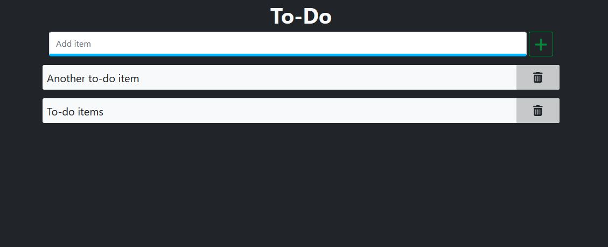

# django-react-todo

Django to-do app with React frontend. Django REST Framework was used for api endpoints.



## Installation / Running the Project

This project can be run locally on your machine by following the steps below. The dependencies below are required for running this:

### Dependencies

-   [Python](https://www.python.org/downloads/)
-   [Django](https://pypi.org/project/Django/)
-   [Django REST Framework](https://pypi.org/project/djangorestframework/)
-   [Django CORS Headers](https://pypi.org/project/django-cors-headers/)

After installation, clone this repository:

```
git clone https://github.com/jacobshortall/django-react-todo.git
```

You will need a local database file to store data. From the project root directory, create one using:

```
touch db.sqlite3
```

Then, run the project using:

```
python manage.py runserver
```

The app will now be available on http://127.0.0.1:8000/.

## Developing the Project Locally

To further develop the project, it's ideal to work on the React development server first, and then build the project for practical use afterwards.

To start, ensure you have [Node JS](https://nodejs.org/en/) installed.

Follow the steps from the previous section on installation, and run the server. Instead of navigating to http://127.0.0.1:8000/, we will run the React frontend separately for development purposes.

From the root directory of the project, once the project is running, navigate to the frontend directory:

```
cd frontend
```

Then, install necessary packages using:

```
npm install
```

From here, you can edit the source files in the frontend project as required, and run the frontend development server using:

```
npm start
```

(Ensure that you are running the Django project as well, so the requests from the frontend can be completed.)

Once you're happy with the changes, create a build version of the project using:

```
npm run build
```

From this point, you can run the project normally as described in the [previous section](#installation--running-the-project).
